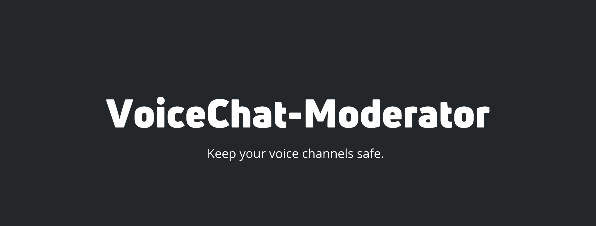

</img>

      

## What is VoiceChat Moderator?
VCM is a discord bot with the sole purpose of preventing things such as "earrape", "bass boosting", or any other obnoxious intrusion in a public discord voice channel.

## Commands
|  Command |           Usage          |      Aliases      |                                     Description                                     |
|:--------:|:------------------------:|:-----------------:|:-----------------------------------------------------------------------------------:|
|   join   |       [id/mention]       | joinvc, vc, start | Join a mentioned voice channel, or a voice channel that the command executor is in. |
| settings | [option] [option-params] |  setting, config  |                         change certain settings of the bot.                         |
|   leave  |                          |        exit       |              Have the bot leave the currently connected voice channel.              |

## Contributing
All contributions are welcome, just open a PR!

## Licensing 

[MIT](https://github.com/zaida04/VoiceChat-Moderator/blob/master/LICENSE)